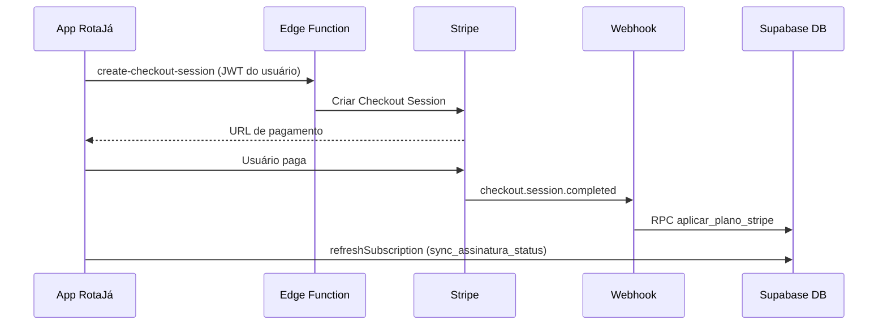

# Pagamentos RotaJá — Guia prático (Stripe + Supabase)

Este guia explica como sair do **sandbox** (simulação no app) e colocar **pagamento real** com Stripe, mantendo os limites de plano automáticos no banco.

---

## Visão geral do fluxo



**Regra de ouro:** o app **nunca** grava `tipo_plano` direto. Só o webhook (service_role) ou as RPCs seguras.

---

## Passo 1 — Aplicar SQL no Supabase (obrigatório)

No **Supabase Dashboard → SQL Editor**, execute nesta ordem:

1. `src/config/migration_assinaturas.sql` (se ainda não rodou)
2. `src/config/migration_security_plans.sql` (**novo** — triggers + RPCs + limites)

Isso habilita:

- Bloqueio de alteração manual de plano pelo cliente
- Limites de fretes do motorista no banco
- Limite mensal de publicações da empresa
- RPCs: `sync_assinatura_status`, `processar_assinatura_pagamento`, etc.
- RPC `aplicar_plano_stripe` para o webhook

**Teste rápido:** no app, sandbox “Pagamento aprovado” deve continuar funcionando após o passo 1.

---

## Passo 2 — Criar conta e produtos no Stripe

1. Acesse [https://dashboard.stripe.com](https://dashboard.stripe.com) e crie a conta (modo **Test** primeiro).
2. Em **Products**, crie 6 assinaturas mensais recorrentes:

| Produto | Valor sugerido (app) | Metadata sugerida |
|---------|----------------------|-------------------|
| Motorista Bronze | R$ 69/mês | `plan_tier=bronze`, `user_group=motorista` |
| Motorista Prata | R$ 89/mês | `plan_tier=prata` |
| Motorista Ouro | R$ 109/mês | `plan_tier=ouro` |
| Empresa Bronze | R$ 199/mês | `plan_tier=bronze`, `user_group=empresa` |
| Empresa Prata | R$ 269/mês | `plan_tier=prata` |
| Empresa Ouro | R$ 359/mês | `plan_tier=ouro` |

3. Copie cada **Price ID** (`price_...`) — você vai usar nos secrets.

---

## Passo 3 — Instalar Supabase CLI e publicar Edge Functions

```bash
npm install -g supabase
supabase login
supabase link --project-ref SEU_PROJECT_REF
```

Defina os secrets:

```bash
supabase secrets set STRIPE_SECRET_KEY=sk_test_...
supabase secrets set STRIPE_WEBHOOK_SECRET=whsec_...
supabase secrets set STRIPE_PRICE_MOTORISTA_BRONZE=price_...
supabase secrets set STRIPE_PRICE_MOTORISTA_PRATA=price_...
supabase secrets set STRIPE_PRICE_MOTORISTA_OURO=price_...
supabase secrets set STRIPE_PRICE_EMPRESA_BRONZE=price_...
supabase secrets set STRIPE_PRICE_EMPRESA_PRATA=price_...
supabase secrets set STRIPE_PRICE_EMPRESA_OURO=price_...
```

Publique as funções:

```bash
supabase functions deploy create-checkout-session
supabase functions deploy stripe-webhook --no-verify-jwt
```

> `stripe-webhook` usa `--no-verify-jwt` porque o Stripe chama sem JWT Supabase.

---

## Passo 4 — Configurar webhook no Stripe

1. Stripe Dashboard → **Developers → Webhooks → Add endpoint**
2. URL: `https://SEU_PROJECT_REF.supabase.co/functions/v1/stripe-webhook`
3. Eventos recomendados:
   - `checkout.session.completed`
   - `invoice.paid`
   - `invoice.payment_failed`
   - `customer.subscription.deleted`
4. Copie o **Signing secret** (`whsec_...`) → `supabase secrets set STRIPE_WEBHOOK_SECRET=...`

---

## Passo 5 — Variáveis no app (.env)

```env
EXPO_PUBLIC_SUPABASE_URL=https://xxx.supabase.co
EXPO_PUBLIC_SUPABASE_ANON_KEY=eyJ...
EXPO_PUBLIC_SUPABASE_PROJECT_ID=xxx

# sandbox = simulação no checkout | stripe = pagamento real
EXPO_PUBLIC_PAYMENTS_MODE=sandbox
```

Quando for para produção:

```env
EXPO_PUBLIC_PAYMENTS_MODE=stripe
```

(Opcional futuro: `EXPO_PUBLIC_STRIPE_PUBLISHABLE_KEY=pk_test_...` se usar Payment Sheet nativo.)

---

## Passo 6 — Ligar o checkout do app ao Stripe

Hoje o checkout usa `AssinaturasService.processarPagamento` (sandbox).

Para Stripe real, no `checkout.tsx`:

1. Se `EXPO_PUBLIC_PAYMENTS_MODE === 'stripe'`:
   - Chamar `StripeCheckoutService.criarSessaoCheckout(tier, group, { successUrl, cancelUrl })`
   - Abrir a URL retornada (`Linking.openURL(url)`)
2. Na tela de sucesso (deep link `rotaja://checkout/success`):
   - Chamar `refreshSubscription()` — o webhook já terá atualizado o plano

Arquivos já preparados:

- `src/services/stripe-checkout.service.ts`
- `supabase/functions/create-checkout-session/index.ts`
- `supabase/functions/stripe-webhook/index.ts`
- `src/config/stripe-plans.ts`

---

## Passo 7 — Deep links (Expo)

No `app.json`, configure o scheme `rotaja` (ou o que preferir) para o retorno após pagamento:

```json
{
  "expo": {
    "scheme": "rotaja"
  }
}
```

URLs usadas nas funções:

- Sucesso: `rotaja://checkout/success`
- Cancelamento: `rotaja://checkout/cancel`

---

## Passo 8 — Validar em ambiente de teste

1. Cartão de teste Stripe: `4242 4242 4242 4242`, qualquer validade/CVC futuros.
2. Fluxo:
   - Login → Planos → Checkout → pagar
   - Verificar no Supabase tabela `assinaturas`: `tipo_plano`, `status_assinatura=ativo`, `stripe_*` preenchidos
   - Abrir **Cargas** (motorista): limite conforme plano
3. Rodar auditoria:

```bash
node --experimental-strip-types src/services/run_audit_tests.ts
```

Variáveis para o script (não commitar chaves):

```bash
set EXPO_PUBLIC_SUPABASE_URL=...
set EXPO_PUBLIC_SUPABASE_ANON_KEY=...
```

---

## Passo 9 — Ir para produção

1. Stripe: ativar conta live, recriar produtos/preços em **Live mode**
2. Trocar secrets para `sk_live_...` e price IDs live
3. Webhook live com a mesma URL da Edge Function
4. `EXPO_PUBLIC_PAYMENTS_MODE=stripe` no build de produção
5. Remover ou ocultar painel sandbox do checkout em produção

---

## O que cada evento Stripe faz no RotaJá

| Evento | Efeito no banco |
|--------|-----------------|
| `checkout.session.completed` | Ativa plano via `aplicar_plano_stripe` |
| `invoice.paid` | Renova / confirma assinatura ativa |
| `invoice.payment_failed` | `status_assinatura=inadimplente` |
| `customer.subscription.deleted` | `tipo_plano=gratuito`, `status=expirado` |

---

## Mercado Pago em vez de Stripe?

É possível, mas exigiria outra Edge Function e outro webhook. Para assinatura mensal recorrente no Brasil, **Stripe** costuma ser mais simples de integrar com Supabase. Mercado Pago faz sentido se você já tiver contrato/volume MP — a arquitetura (webhook → RPC `aplicar_plano_stripe`) seria a mesma.

---

## Checklist final antes de lançar

- [ ] SQL `migration_security_plans.sql` aplicado
- [ ] Webhook Stripe apontando para `stripe-webhook`
- [ ] Price IDs corretos nos secrets
- [ ] Teste de upgrade Bronze → Prata → Ouro
- [ ] Teste de expiração/cancelamento (limite volta / paywall)
- [ ] Sandbox desativado em produção (`PAYMENTS_MODE=stripe`)
- [ ] Chaves **nunca** no repositório (só secrets Supabase + `.env` local)

---

## Suporte

Se o pagamento sandbox falhar com mensagem sobre SQL: execute `migration_security_plans.sql`.

Se Stripe aprovar mas o plano não mudar: verifique logs em **Supabase → Edge Functions → stripe-webhook** e se `metadata.user_id` e `metadata.plan_tier` estão na sessão de checkout.
